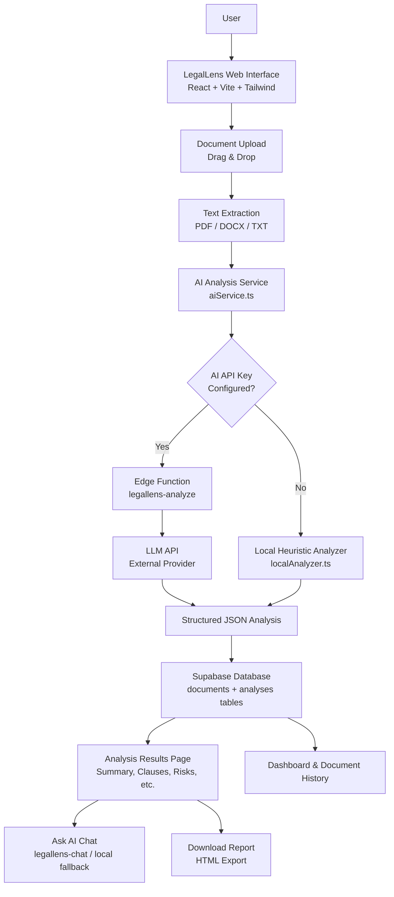
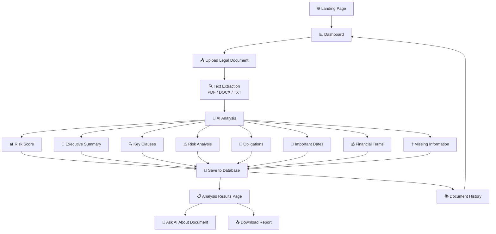

# ⚖️ LegalLens – AI Legal Document Analyzer

**Understand complex legal documents with AI-powered analysis, risk detection, clause extraction, and plain-English explanations.**

<p align="center">
  <em>A college-level AI/ML project that transforms lengthy legal documents into structured, readable insights.</em>
</p>

---

## 📋 Table of Contents

- [Overview](#-overview)
- [Core Features](#-core-features)
- [Technology Stack](#-technology-stack)
- [System Architecture](#-system-architecture)
- [AI Analysis Pipeline](#-ai-analysis-pipeline)
- [Risk Assessment](#-risk-assessment)
- [System Workflow](#-system-workflow)
- [Project Structure](#-project-structure)
- [Getting Started](#-getting-started)
- [Installation](#-installation)
- [Environment Configuration](#-environment-configuration)
- [How to Use](#-how-to-use)
- [Application Preview](#-application-preview)
- [Key Capabilities](#-key-capabilities)
- [Future Enhancements](#-future-enhancements)
- [Disclaimer](#-disclaimer)
- [Connect](#-connect)
- [License](#-license)

---

## 📖 Overview

Legal documents are often lengthy, filled with complex terminology, and difficult for non-legal users to navigate. Important obligations, deadlines, financial terms, and potential risks can be buried across dozens of pages of dense text.

**LegalLens** is a full-stack web application that allows users to upload a legal document — such as a contract, NDA, rental agreement, employment agreement, or service agreement — and receive an AI-assisted structured analysis that identifies:

- 📄 **Document type** — automatic classification of the uploaded agreement
- 📝 **Plain-English summary** — a concise explanation of what the document covers
- 🔍 **Key clauses** — important clauses extracted with original text and simplified explanations
- ⚠️ **Potential risks** — clauses that may warrant careful review, with risk levels and suggestions
- 📊 **Risk score** — a 0–100 score based on detected risk indicators
- 📌 **Obligations** — responsibilities for both parties, categorized by type
- 📅 **Important dates** — effective dates, deadlines, notice periods, and renewal dates
- 💰 **Financial terms** — payment amounts, fees, penalties, deposits, and schedules
- ❓ **Missing or unclear information** — elements that may be absent or ambiguous
- 💬 **Interactive Q&A** — an AI chat interface to ask questions about the document

The application uses a clean AI service layer that can connect to an external LLM API when configured, and falls back to a built-in heuristic analyzer when no API key is available — ensuring the application always produces meaningful results.

---

## ✨ Core Features

| Feature | Description |
|---|---|
| 📄 **Document Upload** | Drag-and-drop interface supporting PDF, DOCX, and TXT files (up to 20 MB) |
| 🔬 **Text Extraction** | Client-side text extraction from PDFs, Word documents, and plain text files |
| 🧠 **AI-Powered Analysis** | Structured analysis using an LLM API (when configured) or a built-in heuristic engine |
| 🔍 **Key Clause Extraction** | Identifies 14 clause types including Payment Terms, Termination, Confidentiality, IP, Liability, and more |
| ⚠️ **Risk Detection** | Flags 8 categories of potential risks with explanations and review suggestions |
| 📊 **Risk Score & Level** | A 0–100 score mapped to Low / Medium / High / Very High risk levels |
| 📝 **Plain-English Summary** | A jargon-free executive summary of the document's purpose and scope |
| 📌 **Obligation Extraction** | Categorized obligations for both the user and the other party |
| 📅 **Important Date Detection** | Extracts effective dates, start/end dates, deadlines, and notice periods |
| 💰 **Financial Term Extraction** | Identifies payment amounts, salaries, interest rates, fees, deposits, and refund terms |
| ❓ **Missing / Unclear Information** | Highlights potentially absent or ambiguous elements requiring review |
| 💬 **Ask AI** | Interactive chat to ask questions about the uploaded document with document-grounded answers |
| 📚 **Document History** | Search, filter by risk level and document type, and sort all analyzed documents |
| 📥 **Downloadable Report** | Export a formatted HTML analysis report with all findings and the legal disclaimer |
| 📱 **Responsive Interface** | Clean, modern UI that works across desktop, laptop, tablet, and mobile |
| 🗄️ **Supabase Integration** | Persistent storage for documents, analyses, and chat messages |

---

## 🛠️ Technology Stack

### Frontend

| Technology | Purpose |
|---|---|
| **React 18** | UI component library |
| **TypeScript** | Type-safe development |
| **Vite** | Build tool and development server |
| **Tailwind CSS** | Utility-first styling framework |
| **Lucide React** | Icon library |
| **React Router v7** | Client-side routing and navigation |

### Backend

| Technology | Purpose |
|---|---|
| **Supabase** | PostgreSQL database, Edge Functions (Deno runtime), and storage |
| **Edge Functions** | Server-side AI analysis and chat endpoints (Deno / TypeScript) |

### AI / LLM

| Component | Description |
|---|---|
| **AI Service Layer** | A clean abstraction in `src/lib/aiService.ts` that calls edge functions for LLM-powered analysis |
| **Edge Function: `legallens-analyze`** | Sends document text to a configurable LLM API with a structured analysis prompt |
| **Edge Function: `legallens-chat`** | Handles document-grounded question answering via the LLM API |
| **Local Heuristic Analyzer** | A built-in fallback engine (`src/lib/localAnalyzer.ts`) that performs pattern-based clause, risk, obligation, date, and financial term extraction when no AI API key is configured |

> The AI provider is configurable through environment variables. Any OpenAI-compatible chat completions endpoint can be used. When no API key is set, the application gracefully falls back to the local analyzer — it never crashes.

### Database

| Technology | Purpose |
|---|---|
| **Supabase PostgreSQL** | Relational database with Row Level Security (RLS) enabled on all tables |
| **Tables** | `documents`, `analyses`, `chat_messages` |

### Document Processing

| Library | Purpose |
|---|---|
| **pdfjs-dist** | Client-side PDF text extraction (page-by-page) |
| **mammoth** | DOCX text extraction in the browser |
| **Native Browser APIs** | TXT file reading via `File.text()` |

### Development Tools

| Tool | Purpose |
|---|---|
| **ESLint** | Code linting with React Hooks and React Refresh plugins |
| **TypeScript ESLint** | TypeScript-specific linting rules |
| **PostCSS + Autoprefixer** | CSS processing pipeline |
| **Vite** | Hot Module Replacement (HMR) dev server and production bundler |

---

## 🏗️ System Architecture

LegalLens follows a client-server architecture where the React frontend communicates with Supabase for data persistence and AI processing.



### Architecture Highlights

- **Client-side text extraction** — PDF and DOCX parsing happens entirely in the browser; only extracted text is sent to the server, not the original binary file
- **Dual analysis modes** — LLM-powered analysis via edge functions when an API key is available; heuristic pattern-based analysis as a zero-dependency fallback
- **Supabase as the sole backend** — Database, edge functions, and storage are all managed through Supabase
- **Row Level Security** — All database tables have RLS enabled with policies allowing anonymous and authenticated access (single-tenant educational application)

---

## 🧠 AI Analysis Pipeline

The analysis pipeline processes an uploaded document through the following stages:

```mermaid
flowchart LR
    A[1. Document Upload] --> B[2. File Validation]
    B --> C[3. Text Extraction]
    C --> D[4. Text Processing]
    D --> E[5. Document Type ID]
    E --> F[6. Key Clause ID]
    F --> G[7. Risk Detection]
    G --> H[8. Obligation Extraction]
    H --> I[9. Date Extraction]
    I --> J[10. Financial Term Extraction]
    J --> K[11. Missing Info Detection]
    K --> L[12. Summary Generation]
    L --> M[13. Risk Score Calculation]
    M --> N[14. Structured JSON Output]
    N --> O[15. Save to Database]
    O --> P[16. Display Results]
```



### Step Details

| Step | Description |
|---|---|
| **1. Document Upload** | User uploads a file via the drag-and-drop interface |
| **2. File Validation** | Checks file type (PDF/DOCX/TXT), file size (max 20 MB), and empty file detection |
| **3. Text Extraction** | Extracts plain text from the uploaded file using format-specific parsers |
| **4. Text Processing** | Normalizes and segments text into sentences for analysis |
| **5. Document Type Identification** | Classifies the document (NDA, Employment, Rental, Service, etc.) using keyword matching against 10 document type categories |
| **6. Key Clause Identification** | Scans for 14 clause types (Payment Terms, Termination, Confidentiality, IP, Non-Compete, Liability, Indemnification, Dispute Resolution, Governing Law, Renewal, Notice Period, Force Majeure, Assignment, Warranties) |
| **7. Risk Detection** | Identifies 8 risk categories (penalty clauses, unclear termination, broad liability, non-compete restrictions, auto-renewal, unilateral discretion, irrevocable rights, broad confidentiality) |
| **8. Obligation Extraction** | Categorizes obligations for the user and the other party by type (Payment, Deadline, Responsibility, Restriction, Deliverable) |
| **9. Important Date Extraction** | Detects dates using multiple regex patterns and associates them with labels (Effective Date, Start Date, End Date, Renewal, Payment Deadline, Notice Period, Termination Deadline) |
| **10. Financial Term Extraction** | Identifies monetary amounts, salaries, interest rates, late fees, deposits, payment schedules, and refund terms |
| **11. Missing Information Detection** | Checks for absent or unclear elements (effective date, governing law, dispute resolution, end date, payment amounts, termination conditions, notice period, liability) |
| **12. Summary Generation** | Produces a plain-English summary describing the document type, covered clauses, and risk areas |
| **13. Risk Score Calculation** | Computes a 0–100 score from detected risks, clause risk levels, and missing information |
| **14. Structured JSON Output** | Assembles all findings into a structured `AnalysisResult` object |
| **15. Save to Database** | Persists the document metadata and analysis to Supabase |
| **16. Display Results** | Renders the analysis across dedicated sections on the results page |

---

## ⚠️ Risk Assessment

LegalLens computes a **risk score from 0 to 100** based on detected risk indicators in the document. The score is derived from:

- **Detected risks** — High risk (+15), Medium risk (+8), Low risk (+4)
- **Clause risk levels** — High risk clause (+5), Medium risk clause (+3)
- **Missing information** — Each missing element (+4, capped at +20)
- **Total is capped at 100**

### Risk Levels

| Score Range | Risk Level | Color Indicator |
|---|---|---|
| 0 – 30 | 🟢 **Low** | Green |
| 31 – 60 | 🟡 **Medium** | Amber |
| 61 – 80 | 🟠 **High** | Orange |
| 81 – 100 | 🔴 **Very High** | Red |

### Risk Categories Detected

| Risk | Level | Why It Matters |
|---|---|---|
| Strong Penalty Clauses | High | Financial consequences if obligations are not met |
| Unclear Termination Conditions | Medium | Difficulty ending the agreement when needed |
| Unlimited or Broad Liability | High | Exposure to significant financial risk |
| Restrictive Non-Compete Clause | High | Limits ability to work in the field after agreement ends |
| Auto-Renewal Provision | Medium | Agreement may extend without explicit consent |
| Unilateral Discretion | Medium | Power imbalance from one party's sole discretion |
| Irrevocable or Perpetual Rights | High | Rights that cannot be undone |
| Broad Confidentiality Obligations | Medium | Long-term restrictions on information use |

> ⚠️ The risk score is an **AI-assisted informational indicator** and is **not** a legal determination. It should not be used as a substitute for professional legal review.

---

## 🔄 System Workflow



---

## 📁 Project Structure

```text
LegalLens/
├── src/
│   ├── components/                 # Reusable UI components
│   │   ├── AppLayout.tsx           # Main layout wrapper with sidebar
│   │   ├── Sidebar.tsx             # Navigation sidebar
│   │   ├── Disclaimer.tsx          # Legal disclaimer banner
│   │   ├── RiskBadge.tsx           # Risk level badge component
│   │   └── RiskScoreGauge.tsx      # Circular risk score gauge
│   ├── pages/                      # Application pages
│   │   ├── Landing.tsx             # Landing page with hero, features, steps
│   │   ├── Dashboard.tsx           # Dashboard with stats and recent documents
│   │   ├── Upload.tsx              # Drag-and-drop document upload
│   │   ├── Analysis.tsx            # Analysis results with all sections + AI chat
│   │   ├── Documents.tsx           # Document history with search/filter/sort
│   │   └── Settings.tsx            # Application settings and information
│   ├── lib/                        # Service layers and utilities
│   │   ├── supabase.ts             # Supabase client singleton
│   │   ├── aiService.ts            # AI analysis & chat service layer
│   │   ├── localAnalyzer.ts        # Heuristic fallback analyzer
│   │   └── documentExtractor.ts    # PDF/DOCX/TXT text extraction
│   ├── types.ts                    # TypeScript types and interfaces
│   ├── App.tsx                     # Router and application root
│   ├── main.tsx                    # React entry point
│   ├── index.css                   # Global styles and Tailwind imports
│   ├── mammoth.d.ts                # Type declaration for mammoth browser
│   └── vite-env.d.ts               # Vite environment type reference
├── supabase/
│   ├── migrations/                 # Database migration SQL
│   │   └── ...create_legallens_tables.sql
│   └── functions/                  # Edge functions (Deno runtime)
│       ├── legallens-analyze/       # AI document analysis endpoint
│       │   └── index.ts
│       └── legallens-chat/          # AI chat Q&A endpoint
│           └── index.ts
├── .env.example                    # Environment variable template
├── .gitignore
├── eslint.config.js                # ESLint configuration
├── index.html                      # HTML entry point
├── package.json
├── postcss.config.js               # PostCSS configuration
├── tailwind.config.js              # Tailwind CSS configuration
├── tsconfig.json                   # TypeScript configuration
├── tsconfig.app.json               # App TypeScript config
├── tsconfig.node.json              # Node TypeScript config
├── vite.config.ts                  # Vite configuration
└── README.md
```

---

## 🚀 Getting Started

### Prerequisites

- **Node.js** 18 or higher
- **npm** (comes with Node.js)
- A **Supabase** project (for database and edge functions)

### Clone Repository

```bash
git clone https://github.com/pudarivyshnavi/LegalLens.git
cd LegalLens
```

---

## 📦 Installation

1. **Install dependencies:**

   ```bash
   npm install
   ```

2. **Set up environment variables:**

   ```bash
   cp .env.example .env
   ```

   Edit the `.env` file with your Supabase project credentials (see [Environment Configuration](#-environment-configuration)).

3. **Start the development server:**

   ```bash
   npm run dev
   ```

   The application will be available at `http://localhost:5173`.

4. **Build for production:**

   ```bash
   npm run build
   ```

5. **Preview the production build:**

   ```bash
   npm run preview
   ```

6. **Run type checking:**

   ```bash
   npm run typecheck
   ```

---

## 🔐 Environment Configuration

Sensitive credentials must **never** be committed to GitHub. Create a `.env` file locally based on `.env.example`:

```env
# --- Frontend (Vite) ---
VITE_SUPABASE_URL=your_supabase_project_url
VITE_SUPABASE_ANON_KEY=your_supabase_anon_key

# --- AI Provider (optional) ---
AI_API_KEY=your_ai_api_key
AI_API_URL=https://api.openai.com/v1
AI_MODEL=gpt-4o-mini
```

| Variable | Description | Required |
|---|---|---|
| `VITE_SUPABASE_URL` | Your Supabase project URL | ✅ Yes |
| `VITE_SUPABASE_ANON_KEY` | Your Supabase anonymous key | ✅ Yes |
| `AI_API_KEY` | API key for the LLM provider (set as Supabase edge function secret) | ❌ Optional |
| `AI_API_URL` | Base URL for an OpenAI-compatible chat completions API | ❌ Optional |
| `AI_MODEL` | Model name to use for analysis (e.g., `gpt-4o-mini`) | ❌ Optional |

> When `AI_API_KEY` is not configured, the application automatically uses the built-in heuristic analyzer. The app works fully without any external AI provider.

---

## 📖 How to Use

1. **Open the application** — Navigate to the landing page and click **Get Started** or **Analyze Document**.
2. **Go to the Dashboard** — View an overview of your documents, including total count, analyzed count, high-risk count, and average risk score.
3. **Upload a document** — Click **Analyze New Document** or go to the **Upload Document** page. Drag and drop a PDF, DOCX, or TXT file (max 20 MB).
4. **Start analysis** — Click the **Analyze Document** button. A loading screen displays each step: extracting text, identifying document type, finding clauses, checking risks, and generating the summary.
5. **Review the executive summary** — Read the plain-English summary at the top of the results page.
6. **Review key clauses** — Browse cards for each detected clause, showing the original text, a plain-English explanation, importance level, and risk level.
7. **Review potential risks** — Check the Risk Analysis section for each detected risk, including why it matters and a suggested review point.
8. **Check obligations** — View your obligations and the other party's obligations, categorized by type.
9. **Review important dates** — See a list of effective dates, deadlines, notice periods, and renewal dates extracted from the document.
10. **Review financial terms** — Check payment amounts, fees, interest rates, deposits, and payment schedules.
11. **Check missing information** — Review potentially missing or unclear elements that may require attention.
12. **Ask AI** — Use the chat interface at the bottom of the results page to ask questions about the document. The AI answers based only on the uploaded document's content.
13. **Download the report** — Click **Download Analysis Report** to export a formatted HTML report with all findings and the legal disclaimer.
14. **View document history** — Go to **My Documents** to search, filter, and sort all previously analyzed documents.

---


## 🎯 Key Capabilities

LegalLens helps users understand the following aspects of a legal document:

| Capability | What It Reveals |
|---|---|
| 📄 **Contract Structure** | The type of agreement and the clauses it contains |
| 📌 **Important Obligations** | What each party is required to do, including payments, deliverables, and restrictions |
| 💰 **Payment Conditions** | Amounts, schedules, fees, penalties, deposits, and refund terms |
| 🔚 **Termination Conditions** | How and when the agreement can be ended |
| 🔒 **Confidentiality Clauses** | What information must be kept private and for how long |
| ⚖️ **Liability Clauses** | Who is responsible for damages and how liability is limited |
| 📅 **Important Dates** | Effective dates, deadlines, notice periods, and renewal dates |
| ⚠️ **Potentially Concerning Terms** | Clauses that may carry risk, with explanations of why |
| ❓ **Missing or Unclear Information** | Elements that may be absent or ambiguous and require review |

> All analysis provided by LegalLens is **AI-assisted and informational**. It does not constitute legal advice.

---

## 🔮 Future Enhancements

LegalLens is an evolving educational project. Planned future improvements include:

- 📷 **OCR for scanned documents** — Text extraction from image-based PDFs using optical character recognition
- 🌍 **Multi-language document analysis** — Support for legal documents in languages other than English
- 📊 **Contract comparison** — Side-by-side comparison of two documents to highlight differences
- 🔄 **Version comparison** — Track changes between different versions of the same agreement
- 🎯 **Source highlighting** — Highlight the exact source text in the document for each extracted item
- 🏷️ **Advanced document classification** — More granular document type detection using ML models
- 📑 **Additional document formats** — Support for RTF, ODT, and image-based formats
- 🧠 **Improved document-grounded Q&A** — Enhanced retrieval and citation for the Ask AI feature
- 👨‍⚖️ **Human legal review integration** — Workflow to flag documents for professional legal review
- 📈 **Advanced analytics dashboard** — Trends and insights across multiple analyzed documents
- 👤 **User authentication** — Multi-user accounts with document isolation and personalized history

---

## ⚠️ Disclaimer

> ⚠️ **Disclaimer:** LegalLens provides AI-assisted document analysis for informational and educational purposes only. It does not provide legal advice and should not replace consultation with a qualified legal professional. The risk scores, clause explanations, and other analysis outputs are generated by automated systems and may not reflect the full legal context of a document. Always consult a licensed attorney for legal guidance.

---

## 🤝 Connect

**Pudari Vyshnavi**

| Platform | Link |
|---|---|
| **GitHub** | [https://github.com/pudarivyshnavi](https://github.com/pudarivyshnavi) |
| **LinkedIn** | (https://www.linkedin.com/in/pudari-vyshnavi-99a394316/) |

---


---

<p align="center">
  <em>LegalLens — Built as a college-level AI/ML project for educational purposes.</em>
</p>
